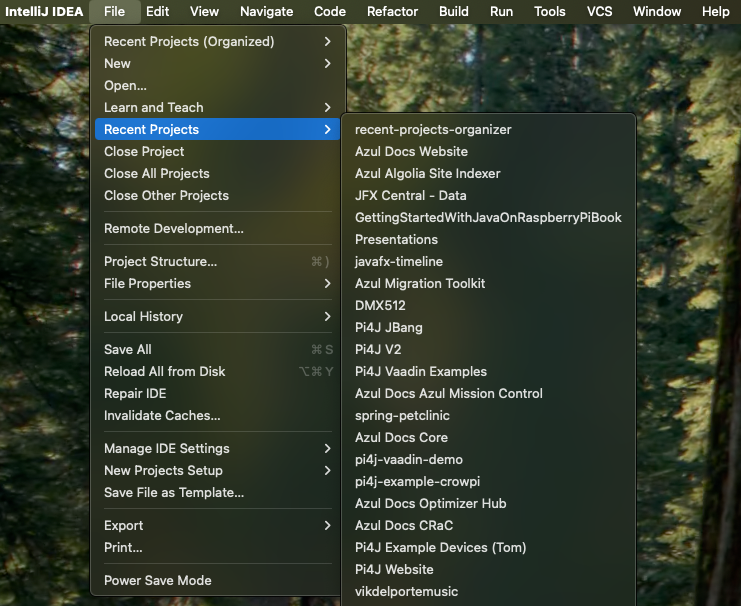
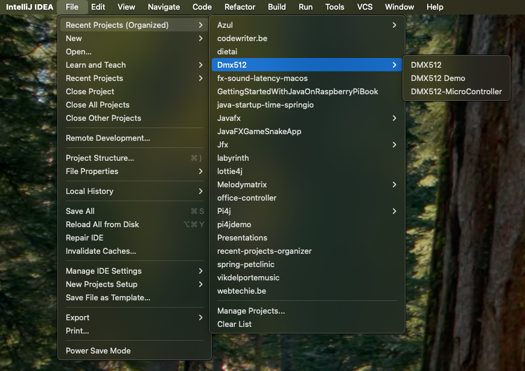

# Recent Projects Organizer

> A plugin for the IntelliJ platform to organize the list in "Recent Projects".
> 
> **WORK IN PROGRESS**

## Table of Contents

* [Description](#description)
* [Installation](#installation)
* [License](#license)
* [Credits](#credits)
* [Donate](#donate)

## Description

This plugin groups the recent projects by the first word in their (display)
name by "space", "-", "_", or ". When multiple projects have the same first
word, they are grouped in a sub-group.

Existing "Recent Projects":



New "File" option added by this plugin: "Recent Projects (Organized)":




## Installation

**NOT AVAILABLE YET**

Use the IDE's built-in plugin system:

* `File` --> `Settings...` --> `Plugins` --> `Marketplace`
* search for: `Recent Projects Organizer`
* click the `Install`-button

Or go to the [plugin page]() on the [JetBrains](https://www.jetbrains.com)-website, download the archive-file and install manually.

## Development

To try the plugin during development:

```
./gradlew runIde
```

This will:

* Build your plugin
* Launch a new IntelliJ IDEA instance with your plugin installed
* Allow you to test your plugin in a real environment

To debug the plugin:

* Via Gradle Tool Window
* Navigate to: Tasks → intellij → runIde
* Right-click on runIde → Debug 'runIde'


## License

Please read the [license](LICENSE) file.

## Credits


## Donate

If you like this plugin, please consider a [donation](https://buymeacoffee.com/frankdelporte). Thank you!
